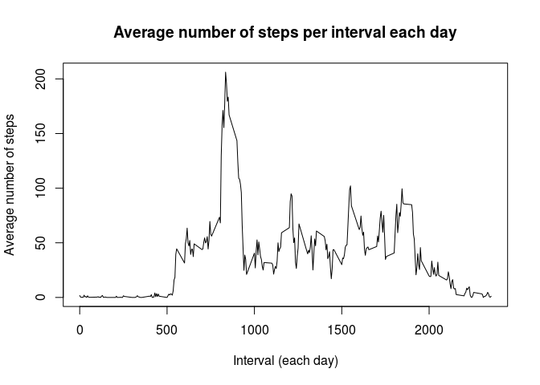

# Reproducible Research: Peer Assessment 1


## Loading and preprocessing the data


```r
library(lubridate)
df <- read.csv("activity.csv")  # read the data
df$date <- ymd(df$date)         # convert the date from string 'Factor' to date class

cc <- complete.cases(df)        # remove NA's
goodDf <- df[cc,]
```

## What is mean total number of steps taken per day?


```r
aggMean <- aggregate(steps ~ date, goodDf, mean)  # aggregate by date, take mean of number of steps
aggMedian <- aggregate(steps ~ date, goodDf, median)  # aggregate by date, take median of number of steps
aggSum  <- aggregate(steps ~ date, goodDf, sum)   # aggregate by date, take sum of number of steps

hist(aggSum$steps, breaks=20, xlab="steps per day", main="Number of steps per day")
```

 

```r
extra <- data.frame(aggSum$date, aggSum$steps, aggMean$steps, aggMedian$steps)  # assemble new data frame to report mean, sum, median
names(extra) <- c("Date", "Sum", "Mean", "Median")
extra
```

```
##          Date   Sum       Mean Median
## 1  2012-10-02   126  0.4375000      0
## 2  2012-10-03 11352 39.4166667      0
## 3  2012-10-04 12116 42.0694444      0
## 4  2012-10-05 13294 46.1597222      0
## 5  2012-10-06 15420 53.5416667      0
## 6  2012-10-07 11015 38.2465278      0
## 7  2012-10-09 12811 44.4826389      0
## 8  2012-10-10  9900 34.3750000      0
## 9  2012-10-11 10304 35.7777778      0
## 10 2012-10-12 17382 60.3541667      0
## 11 2012-10-13 12426 43.1458333      0
## 12 2012-10-14 15098 52.4236111      0
## 13 2012-10-15 10139 35.2048611      0
## 14 2012-10-16 15084 52.3750000      0
## 15 2012-10-17 13452 46.7083333      0
## 16 2012-10-18 10056 34.9166667      0
## 17 2012-10-19 11829 41.0729167      0
## 18 2012-10-20 10395 36.0937500      0
## 19 2012-10-21  8821 30.6284722      0
## 20 2012-10-22 13460 46.7361111      0
## 21 2012-10-23  8918 30.9652778      0
## 22 2012-10-24  8355 29.0104167      0
## 23 2012-10-25  2492  8.6527778      0
## 24 2012-10-26  6778 23.5347222      0
## 25 2012-10-27 10119 35.1354167      0
## 26 2012-10-28 11458 39.7847222      0
## 27 2012-10-29  5018 17.4236111      0
## 28 2012-10-30  9819 34.0937500      0
## 29 2012-10-31 15414 53.5208333      0
## 30 2012-11-02 10600 36.8055556      0
## 31 2012-11-03 10571 36.7048611      0
## 32 2012-11-05 10439 36.2465278      0
## 33 2012-11-06  8334 28.9375000      0
## 34 2012-11-07 12883 44.7326389      0
## 35 2012-11-08  3219 11.1770833      0
## 36 2012-11-11 12608 43.7777778      0
## 37 2012-11-12 10765 37.3784722      0
## 38 2012-11-13  7336 25.4722222      0
## 39 2012-11-15    41  0.1423611      0
## 40 2012-11-16  5441 18.8923611      0
## 41 2012-11-17 14339 49.7881944      0
## 42 2012-11-18 15110 52.4652778      0
## 43 2012-11-19  8841 30.6979167      0
## 44 2012-11-20  4472 15.5277778      0
## 45 2012-11-21 12787 44.3993056      0
## 46 2012-11-22 20427 70.9270833      0
## 47 2012-11-23 21194 73.5902778      0
## 48 2012-11-24 14478 50.2708333      0
## 49 2012-11-25 11834 41.0902778      0
## 50 2012-11-26 11162 38.7569444      0
## 51 2012-11-27 13646 47.3819444      0
## 52 2012-11-28 10183 35.3576389      0
## 53 2012-11-29  7047 24.4687500      0
```

## What is the average daily activity pattern?


```r
aggInterval <- aggregate(steps ~ interval, goodDf, mean)
plot(aggInterval$interval, aggInterval$steps, type = "l", xlab="Interval (each day)", ylab="Average number of steps")
title(main="Average number of steps per interval each day")
```

 

```r
sorted <- aggInterval[with(aggInterval, order(steps, decreasing=TRUE)),]
maxInterval <- sorted[1,1]
maxAvgVal <- sorted[1,2]
```

The interval numbered 835 is the one with the highest number of averages steps, 206.1698113.

## Imputing missing values


```r
sizeNA <- length(df[,1]) - length(which(cc))
```
The number of NA's in the original data set was 2304.


## Are there differences in activity patterns between weekdays and weekends?
